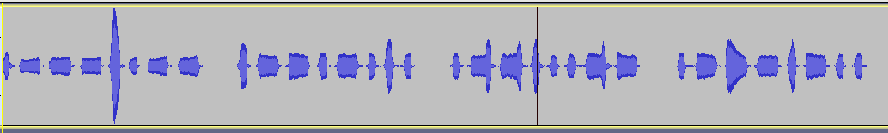

### description
---
If sound can't travel in a vacuum then how did a microphone pick this up in space unless space is a made up concept designed to make us fear leaving Earth and joining with Xenu and the Galactic Confederacy?

File: signal.wav

### solve
---
* The audio is noisy, use audacity to reduce the noise
* Short beep corresponds to 0, long beep corresponds to 1
* Decode the binary in cyberchef

Flag:
```
shctf{N0 1 c4n H34r u 833P_800p(In) < /dev/nullspace}
```