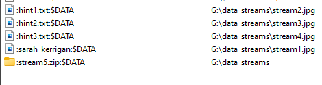
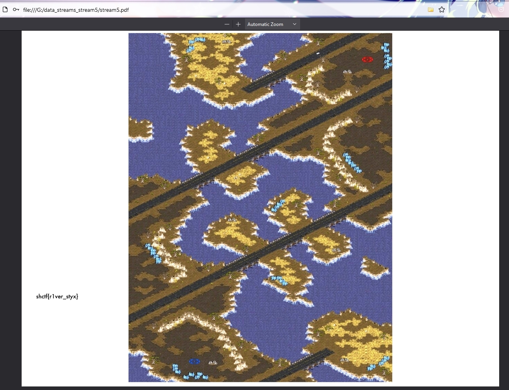

### description 
---
Our recon troops gathered information about the enemy territory and reported back to our Planetary Fortress. However, Zerg's Red team hackers infiltraded our database and hid all information about where their main Lair is located. Can you recover the missing image for us?

### solve
----
* Use [this tool](https://www.nirsoft.net/utils/alternate_data_streams.html) to extract the stream5.zip file that has a password protected **pdf file**.
 
 * sarah_kerrigan contains the following hint: 
	 * "I should stop using my name as password. Maybe I can just hide my file, they will never find it."
* Open the PDF with sarah_kerrigan as the password and profit

Flag:
